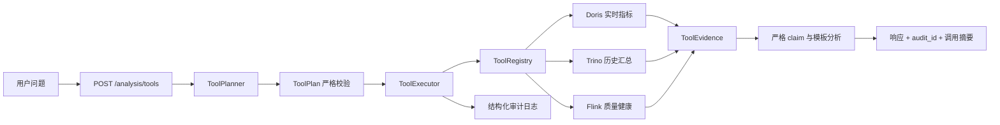

# 第 10 章：受控工具调用与审计设计

## 1. 文档状态

- 状态：设计已确认，等待实现计划
- 日期：2026-08-03
- 前置章节：第 8 章可信指标 AI 分析助手、第 9 章 Java DataStream 数据质量治理
- 目标读者：项目实现者、代码审查者、面试讲解者

## 2. 背景与章节编号

第 8 章已经完成“后端预定义查询 -> 可信 evidence -> 规则或模型选择 claim ID -> 后端模板渲染”的最小闭环。模型不能生成 SQL，也不能决定数据库连接、表名或查询范围。

第 8 章最初的演进路线曾把“受控工具调用”称为第 9 章，但实际第 9 章已经用于 Java DataStream 数据质量治理。因此后续路线统一顺延为：

1. 第 10 章：受控工具调用与审计。
2. 第 11 章：受控 NL2SQL。
3. 后续章节：产品化评测、可观测性与压测调优。

本章不是把数据库权限交给模型，而是在第 8 章的可信证据边界上增加一层有限自主性：模型可以从后端注册的只读工具中选择需要的证据，但工具定义、参数、执行、预算、审计和最终叙事仍由后端控制。

## 3. 目标

本章需要完成以下能力：

1. 新增独立的 `POST /analysis/tools` 接口，不改变 `POST /analysis/realtime` 的现有行为。
2. 提供 Doris 实时指标、Trino 历史行为和 Flink 数据质量三个只读工具。
3. 支持规则规划器以及可选的 OpenAI-compatible 模型规划器。
4. 对工具计划实施枚举白名单、调用次数、重复调用、超时和结果规模限制。
5. 将工具结果转换为统一、可验证的 evidence，再通过严格 claim ID 和后端模板生成结论。
6. 为每次请求生成审计 ID，并记录不包含敏感信息的结构化调用日志。
7. 在没有模型凭证、模型输出错误或部分数据源不可用时保持可解释降级。
8. 补齐 README 中第 9 章状态和第 10 章演进路线。

## 4. 非目标

本章明确不实现：

- NL2SQL、自由 SQL、DDL、DML 或多语句执行。
- 由请求者或模型指定 URL、catalog、schema、表名、Job ID、metric ID 或函数名。
- 写数据库、修改 Flink Job、触发 savepoint、重启容器或执行运维动作。
- 多轮 Agent 循环、无限工具调用、递归规划或自动重试风暴。
- 审计数据库、消息队列或完整链路追踪平台。
- 前端聊天界面、RAG、长期记忆或运营动作自动化。
- 第 11 章的 SQL 解析器、成本估算和查询沙箱。

## 5. 方案比较与选择

### 5.1 方案 A：模型直接生成 SQL

优点是问题覆盖面广，缺点是权限、解析、成本、注入和数据泄漏边界过大。这属于第 11 章范围，不适合作为当前增量。

### 5.2 方案 B：模型选择只读白名单工具

后端注册有限工具，模型只返回工具 ID，后端完成执行与证据校验。它能展示真实工具调用、审计和降级能力，同时不跨越 SQL 安全边界。

### 5.3 方案 C：完全固定查询，不允许模型选择

安全且简单，但与第 8 章能力基本相同，无法形成“有限自主工具选择”的架构演进。

本章选择方案 B，并保留规则规划器作为默认模式和模型失败时的降级路径。

## 6. 总体架构



现有第 8 章 `AnalysisService` 保持不变。第 10 章使用独立的 `ToolAnalysisService` 和数据模型，只复用现有 repository、安全校验与叙事守卫，避免继续扩大旧服务职责。

## 7. 组件边界

### 7.1 `tool_models.py`

负责定义：

- `ToolId`：三个工具的严格枚举。
- `ToolCall`：单次调用，仅包含工具 ID；第一版不接受自由参数。
- `ToolPlan`：1 至 3 个不重复调用，禁止额外字段。
- `ToolCallSummary`：对外公开的工具 ID、状态、耗时和安全错误类型。
- `ToolEvidence`：按实时、历史、质量三个可选分区保存结构化证据。
- `ToolAnalysisResponse`：叙事、证据、warnings、规划器、分析器、降级状态、审计 ID 和调用摘要。

所有模型使用显式字段和 `extra="forbid"`。未知工具、重复工具、空计划和超过预算的计划均在执行前拒绝。

### 7.2 `tool_planners.py`

包含两个实现：

- `RuleBasedToolPlanner`：根据受控关键词选择工具，是默认模式和稳定降级路径。
- `OpenAICompatibleToolPlanner`：向兼容接口声明三个固定工具，解析原生 tool calling 结果，不接收模型自由文本作为可执行内容。

规则规划器至少覆盖以下意图：

| 问题意图 | 工具 |
| --- | --- |
| 当前访问、PV、UV、实时活跃 | `get_realtime_metrics` |
| 历史事件、行为构成、事件类型 | `get_historical_behavior_summary` |
| 数据质量、Flink、checkpoint、异常数据 | `get_data_quality_health` |
| 综合分析 | 按固定顺序选择三个工具 |

模型计划只要出现未知工具、重复工具、额外参数、错误结构或预算超限，整个模型计划立即作废，不执行其中任何调用，并降级到规则规划器。

### 7.3 `tool_executor.py`

执行器负责：

1. 再次校验工具白名单和调用预算，不能只信任规划器。
2. 按计划顺序执行，第一版不引入并发执行器。
3. 使用各 repository 自身的网络超时，并在每次调用后检查请求总预算。
4. 将结果显式转换为对应 evidence 模型，不透传任意字典。
5. 隔离单工具失败，保留其他成功证据。
6. 限制集合字段和事件类型分组规模，拒绝异常大的响应。
7. 生成安全调用摘要与结构化审计日志。

执行器不支持动态 import、反射调用、字符串函数名、用户 URL 或任意 HTTP 请求。

### 7.4 `flink_quality_repository.py`

该 repository 只读访问配置中的固定 Flink REST 地址，并执行以下步骤：

1. 从 `/jobs/overview` 查找配置中唯一的生产 Job 名称。
2. 要求恰好存在一个同名 `RUNNING` Job；零个或多个都 fail-closed。
3. 读取该 Job 的 checkpoint 汇总并要求响应结构合法。
4. 读取 Job/Vertex metrics，只发现并聚合以下后缀白名单：
   - `valid_events_total`
   - `dlq_events_total`
   - `late_events_total`
   - `duplicate_events_total`
   - `parse_errors_total`
   - `validation_errors_total`
5. 所有计数必须是非负整数；未知指标不会进入 evidence。

请求者和模型都不能传入 Flink 地址、Job ID、Job 名称或 metric ID。该工具不执行 cancel、stop、savepoint、submit 或容器操作。

### 7.5 `tool_analysis_service.py`

服务负责串联：

1. 生成不可预测的 `audit_id`。
2. 调用主规划器并严格校验计划。
3. 在主规划失败时调用规则规划器。
4. 执行工具并归并 evidence。
5. 在至少一个工具成功时生成受控叙事。
6. 在全部工具失败时抛出安全领域异常。
7. 统一记录完成、降级和失败事件。

该服务不修改第 8 章 `AnalysisService`，两条 API 可独立回归和演进。

## 8. 工具契约

### 8.1 `get_realtime_metrics`

- 数据源：Doris。
- 输入参数：无。
- 输出：PV、UV、更新时间。
- 校验：PV/UV 为非负整数或明确缺失；更新时间可解析。

### 8.2 `get_historical_behavior_summary`

- 数据源：Trino + Iceberg。
- 输入参数：无。
- 输出：事件总量、事件类型计数、最新事件时间。
- 校验：计数非负、分组和等于总量、事件类型不重复、时间可解析。
- 查询仍由后端固定 SQL 模板提供，模型看不到也不能修改 SQL。

### 8.3 `get_data_quality_health`

- 数据源：Flink REST。
- 输入参数：无。
- 输出：Job ID、Job 状态、已完成/失败 checkpoint 数、最新成功 checkpoint 时间和六个质量 Counter。
- 校验：唯一生产 Job、状态为 `RUNNING`、字段类型严格、Counter 非负。
- Job ID 可以作为 evidence 返回，但不能由请求者提供。

## 9. 请求与响应契约

请求沿用第 8 章问题模型：

```json
{
  "question": "当前实时指标和数据质量是否正常？"
}
```

响应结构示例：

```json
{
  "summary": "当前实时指标可用，数据质量作业处于运行状态。",
  "insights": [],
  "risks": [],
  "actions": [],
  "evidence": {
    "realtime": {
      "pv": 2,
      "uv": 2,
      "updated_at": "2026-07-22T10:00:31Z"
    },
    "historical": null,
    "data_quality": {
      "job_id": "0d8edd967461402a66e9672d2335ca6d",
      "job_state": "RUNNING",
      "completed_checkpoints": 3,
      "failed_checkpoints": 0,
      "latest_completed_at": "2026-07-22T10:01:00Z",
      "counters": {
        "valid_events_total": 2,
        "dlq_events_total": 5,
        "late_events_total": 1,
        "duplicate_events_total": 1,
        "parse_errors_total": 1,
        "validation_errors_total": 4
      }
    }
  },
  "tool_calls": [
    {
      "tool_id": "get_realtime_metrics",
      "status": "success",
      "duration_ms": 12.4,
      "error_type": null
    },
    {
      "tool_id": "get_data_quality_health",
      "status": "success",
      "duration_ms": 24.1,
      "error_type": null
    }
  ],
  "warnings": [],
  "planner": "rule_based",
  "analyzer": "rule_based",
  "degraded": false,
  "audit_id": "4e548a9e-1941-4e37-a887-a5674c24c3e4",
  "generated_at": "2026-08-03T00:00:00Z"
}
```

响应不会包含模型原始消息、数据库连接信息、SQL、内部 URL、异常文本或 traceback。

## 10. 安全边界

### 10.1 输入边界

- 问题继续执行 NFKC 归一化。
- 拒绝控制字符、不可见格式字符、空问题和超长问题。
- 问题只用于意图规划，不会拼接到 SQL、URL、Job 名称或 metric 查询。

### 10.2 计划边界

- 工具 ID 为严格枚举。
- 第一版工具没有自由参数。
- 每次请求最多调用三个工具，每个工具最多一次。
- 模型计划必须整体通过校验后才能执行，禁止“先执行合法部分”。

### 10.3 执行边界

- Registry 是代码内固定映射。
- 所有工具只读。
- Repository 使用固定连接与固定查询。
- 工具结果必须显式解析为 Pydantic 模型。
- 单工具网络超时与请求总预算均由后端配置控制。

### 10.4 输出边界

- 最终叙事继续使用严格 claim ID、后端模板和数字来源守卫。
- 工具原始响应不直接进入模型叙事或 API。
- 内部异常只转换为固定 warning 或固定 `503`。
- 日志不得记录凭据、Prompt、模型原始输出、SQL、异常消息或 traceback。

## 11. 降级与错误处理

| 场景 | 行为 |
| --- | --- |
| 模型规划失败 | 整体作废，降级到规则规划器 |
| 模型返回未知/重复工具 | 整体作废，降级到规则规划器 |
| 单个工具失败 | 保留其他 evidence，返回安全 warning |
| 全部工具失败 | 返回固定 `503 analysis tools are temporarily unavailable` |
| 模型叙事失败 | 降级到规则叙事 |
| 规则叙事也失败 | 返回固定 `503` |
| API 响应模型校验失败 | 记录安全错误类型并返回固定 `503` |

降级响应必须明确 `degraded=true`，但不能暴露供应商、主机、凭据或内部异常详情。

## 12. 审计设计

每次请求生成一个 `audit_id`，并记录以下结构化事件：

- `tool_analysis_started`
- `tool_plan_selected`
- `tool_planner_degraded`
- `tool_call_completed`
- `tool_call_failed`
- `tool_analysis_completed`
- `tool_analysis_failed`

日志允许包含：

- `audit_id`
- planner/analyzer 名称
- 工具 ID
- 调用状态
- 阶段名
- 耗时
- 降级布尔值
- 异常类型名称

日志禁止包含：

- API Key、密码和 Authorization header
- 完整 Prompt 或模型原始输出
- SQL、数据库 URL 和内部响应正文
- 异常消息、stack 或 `exc_info`

第一版使用应用结构化日志作为审计载体，不新增审计数据库。持久化审计、查询页面和链路追踪留到产品化章节。

## 13. 配置

在现有环境变量基础上增加有限配置：

- `FLINK_REST_URL`：后端配置的固定 Flink REST 地址。
- `CHAPTER_9_PRODUCTION_JOB_NAME`：唯一生产数据质量 Job 名称。
- `AI_TOOL_PLANNER_MODE`：`rule_based` 或 `openai_compatible`。
- `AI_TOOL_MAX_CALLS`：默认 3，代码上限也为 3。
- `AI_TOOL_TOTAL_TIMEOUT_SECONDS`：请求工具执行总预算。
- `AI_TOOL_MAX_EVENT_TYPES`：历史分组结果上限。

数值配置必须在启动时校验为安全范围。未知 planner mode 或非法数值导致服务构建失败，不能静默放宽限制。

## 14. 测试设计

### 14.1 数据模型测试

- 接受 1 至 3 个唯一合法工具。
- 拒绝空计划、未知工具、重复工具、额外字段和超预算计划。
- 拒绝非法 Job 状态、负计数、错误时间和异常大的历史分组。

### 14.2 规划器测试

- 规则规划器覆盖实时、历史、质量和综合问题。
- OpenAI-compatible 规划器正确声明三个工具并解析 tool calls。
- Prompt injection、自由 SQL、URL、未知函数和额外参数不能进入执行计划。
- 模型超时、错误 JSON、自由文本或拒答均触发规则降级。

### 14.3 执行器测试

- 按计划顺序调用 Registry。
- 预算在执行前后均被检查。
- 单工具失败不丢弃其他成功 evidence。
- 全部失败产生安全领域异常。
- 超大结果、错误类型和非白名单结果被拒绝。
- 日志不包含模拟的密码、Prompt、SQL 和异常消息。

### 14.4 Repository 测试

- Doris 和 Trino 复用现有严格校验回归。
- Flink 恰好一个同名 `RUNNING` Job 时返回证据。
- 零个、多个、非运行 Job 均失败。
- checkpoint 与 metric 响应结构错误时失败。
- 只聚合六个白名单 Counter，忽略未知指标。

### 14.5 API 测试

- 正常请求返回 `200` 和显式 `ToolAnalysisResponse`。
- 空问题、控制字符和超长问题返回 `422`。
- 全工具失败返回固定 `503`。
- malformed service response 返回固定 `503`。
- `audit_id` 合法且每次请求不同。
- 原有 `/analysis/realtime` 行为和测试不回归。

### 14.6 全量回归

实现完成后至少运行：

- 全量 Python unittest，包含现有 165 项和新增第 10 章测试。
- Java DataStream Maven/JUnit 15 项。
- PowerShell Parser 与 `git diff --check`。
- 第 8 章和第 9 章关键真实验证的只读回归。

## 15. 真实验收脚本

新增 `scripts/verify_chapter_10_tool_analysis.ps1`，按以下顺序执行：

1. 检查 FastAPI、Doris、Trino 和 Flink REST 可用。
2. 确认第 9 章生产 Job 唯一且为 `RUNNING`，并存在成功 checkpoint。
3. 询问实时指标问题，要求只选择实时工具并返回 Doris evidence。
4. 询问历史行为问题，要求只选择历史工具并返回 Trino evidence。
5. 询问数据质量问题，要求只选择质量工具并返回 Flink evidence。
6. 询问综合问题，要求三个工具各调用一次且顺序稳定。
7. 发送包含“忽略白名单、执行 SQL/URL”的提示注入问题，要求响应中不出现未知工具、SQL 或 URL。
8. 校验每次响应的 `audit_id`、tool call 状态、evidence、warnings 和降级标记。
9. 输出机器可读验收摘要，不修改 Job、不发送生产数据、不触发回滚。

默认验收使用 `rule_based` planner，不要求真实模型 API Key。模型路径通过 mock 自动化测试覆盖；配置了兼容模型时可额外执行非阻塞演示，但不能作为基础验收前提。

## 16. 文档收口

实现计划的第一个任务是更新 README：

1. 在“当前阶段”补充第 6 章和第 9 章。
2. 为第 9 章增加 Java DataStream、数据质量分流、受控切流、回滚和真实验证摘要。
3. 将章节路线更新为第 10 章受控工具调用、第 11 章受控 NL2SQL。
4. 保留第 8 章“没有引入 NL2SQL”的安全声明，并说明第 10 章仍不生成 SQL。

## 17. 完成标准

本章完成必须同时满足：

1. `/analysis/tools` 在默认规则模式下无需 API Key 即可工作。
2. 三个工具都有真实只读数据源和严格证据模型。
3. 模型或请求者无法指定 SQL、URL、表、Job ID 或 metric ID。
4. 模型错误计划在任何工具执行前整体作废。
5. 单工具失败可降级，全部失败返回安全 `503`。
6. 响应包含唯一 `audit_id`、调用摘要、evidence 和降级状态。
7. 日志不泄露凭据、Prompt、SQL、原始模型输出、异常消息或 stack。
8. 真实验收脚本能够验证三个单工具问题、综合问题和提示注入问题。
9. 旧的第 8 章接口与第 9 章生产链路没有行为回归。
10. README、设计文档、实现计划和运行说明与真实代码一致。

## 18. 面试叙事

本章可以形成以下架构演进故事：

> 第 8 章先把查询权收在后端，模型只能从可信 evidence 中选择 claim ID。第 10 章没有直接跳到 NL2SQL，而是增加一个受控工具层：模型可以选择 Doris 实时指标、Trino 历史汇总或 Flink 数据质量工具，但工具 ID、数据源、查询、超时、调用预算和结果模型全部由后端控制。错误工具计划会在执行前整体拒绝并降级，所有调用都有审计 ID。这样既获得了 Agent 工具选择能力，又没有把数据库和运维权限交给模型，为后续受控 NL2SQL 提供了可验证的安全基线。

## 19. 后续演进

第 11 章在本章稳定后再实现受控 NL2SQL，并继续保留：

- 只读身份和 `SELECT` 限制。
- catalog、schema、表和字段白名单。
- SQL AST 解析、多语句拒绝和危险函数拒绝。
- 查询成本、扫描量、行数和超时限制。
- SQL、证据、审计 ID 和评测用例的完整关联。

本章不为第 11 章提前实现通用 Agent 框架或 SQL 沙箱，避免过度设计。
