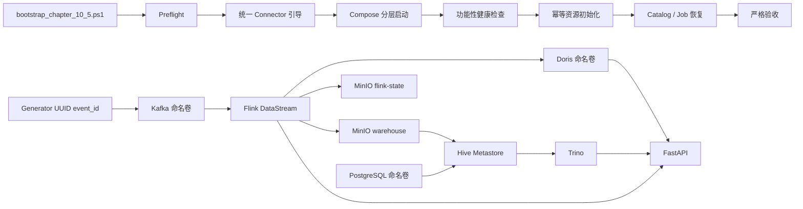

# 第 10.5 章：持久化、冷启动与运行可靠性加固设计

## 1. 文档状态

- 状态：设计已确认，等待实现计划
- 日期：2026-08-25
- 前置章节：第 9 章 Java DataStream 数据质量治理、第 10 章受控工具调用与审计
- 后续章节：第 11 章受控 NL2SQL
- 目标读者：项目实现者、代码审查者、面试讲解者

## 2. 背景

第 0 至第 10 章已经形成可真实运行的主链路：

`Generator -> Kafka -> Flink -> Doris / Iceberg -> Trino -> FastAPI -> AI 分析`

现有 Python 和 Java 测试均已通过，第 10 章也完成了真实工具调用验收。但当前环境仍依赖已经运行过的历史现场，尚不能把“当前机器可运行”等同于“干净克隆可复现、容器重建可恢复、故障状态可判断”。主要问题包括：

1. Generator 每次启动都从相同序号生成 `event_id`，与第 9 章 24 小时去重语义冲突。
2. Hive Metastore 使用容器内 Derby，容器重建后可能丢失 Iceberg 表指针，而 MinIO 文件仍然存在。
3. Kafka、Doris 缺少仓库显式管理的持久卷；Flink checkpoint/savepoint 仍位于工作区本地目录。
4. Flink Connector 分散在多个章节脚本中下载，干净克隆无法保证启动前全部依赖齐全。
5. 第 10 章验收依赖服务、表和第 9 章生产 Job 预先存在，不是冷启动入口。
6. `/health` 只证明 API 进程存活，无法识别依赖不可用或 Flink checkpoint 停滞。
7. 工具调用使用一次一线程的超时隔离；底层阻塞操作不响应超时时，线程可能继续存活并无限累积。

因此在进入第 11 章前，先增加第 10.5 章工程化收尾。本章不扩展业务能力，而是提高现有能力的可恢复性、可复现性和可信度。

## 3. 目标

本章需要完成以下能力：

1. 让事件 ID 在进程重启和多实例之间保持唯一。
2. 将 Hive Metastore 从内嵌 Derby 演进到 PostgreSQL。
3. 为 Kafka、Doris 和 PostgreSQL 配置仓库显式管理的命名卷。
4. 将第 9 章 checkpoint/savepoint 迁移到 MinIO 独立 bucket。
5. 保留现有 MinIO Iceberg 明细，并在 PostgreSQL Metastore 中安全恢复固定表注册。
6. 提供统一、幂等、非破坏性的 Windows PowerShell 冷启动入口。
7. 统一准备全部 Flink Connector，并对下载文件做完整性校验。
8. 为 Compose 与 FastAPI 增加真实 readiness 语义和 checkpoint 新鲜度判断。
9. 为工具规划、工具执行和叙事生成建立统一端到端 deadline。
10. 使用固定容量执行器限制阻塞工具调用的线程资源上限。

## 4. 非目标

本章明确不实现：

- 第 11 章受控 NL2SQL、SQL 解析器、成本估算或查询沙箱。
- 前端看板、AI 聊天界面或视觉产品化。
- GitHub Actions、跨平台 Bash 支持或 Kubernetes 部署。
- Kafka 三 Controller、多 Broker、TLS/SASL 或生产级高可用集群。
- 完整 API Key、OIDC、RBAC 或分布式限流。
- Prometheus、Grafana、链路追踪、压测和 P95/P99 调优报告。
- Kafka 历史消息、旧 consumer offset、Doris 实时指标和 Derby 数据库的逐字节迁移。
- 将已经写入 Doris 或 Iceberg 的业务结果自动撤销。

API 在本章默认仅绑定宿主机 `127.0.0.1`，作为完整认证进入产品化章节前的本地演示安全边界。

## 5. 方案比较与选择

### 5.1 方案 A：继续使用 Derby，只持久化容器目录

优点是改动小，缺点是 Derby 仍不适合作为长期共享 Metastore，恢复和并发能力有限，也无法形成清晰的架构演进。

### 5.2 方案 B：PostgreSQL Metastore + 分层 Bootstrap

PostgreSQL 持久化 catalog，MinIO 保存湖数据与 Flink 状态，Kafka/Doris 使用命名卷；一个 PowerShell 总入口按阶段执行预检、依赖准备、服务就绪、幂等初始化、Job 恢复和严格验收。

该方案能解决真实审计问题，同时保留现有分章脚本和本地 Compose 的学习价值。

### 5.3 方案 C：全部构建为自定义不可变镜像

可复现性最好，但会同时引入 API、Flink、Hive 镜像构建与发布流程，工作量接近新章节，并把重点从数据平台可靠性转移到镜像工程。

本章选择方案 B。自定义不可变镜像、完整依赖锁和 CI 留到产品化章节。

## 6. 总体架构

持久状态分为三类：

1. 原始与消费状态：Kafka Topic、事务和 consumer offset。
2. 计算恢复状态：Flink checkpoint/savepoint。
3. 服务与湖仓状态：Doris 数据、MinIO Iceberg 文件、PostgreSQL Metastore。

所有持久状态都必须有明确归属，不依赖 Docker 自动创建且名称不可控的匿名卷。

## 7. 事件 ID 设计

### 7.1 问题

当前 Generator 使用进程内计数器生成 `evt_000001`。进程重启或多个实例并行运行时会重复，而第 9 章按 `event_id` 保存 24 小时去重状态，导致合法新事件被送入 DLQ。

### 7.2 新格式

默认事件 ID 改为：

`evt_<uuid4-hex>`

例如：

`evt_3f38b26181fc4825aab63058f23c65d4`

设计要求：

- 使用 UUID4，不依赖本地时间、进程 ID 或共享计数器。
- 保留 `evt_` 前缀，维持日志和现有测试的可读性。
- Generator 接受可注入的 ID 工厂，测试不依赖随机结果。
- `seed` 只控制业务字段随机性，不承诺固定事件 ID。
- 不修改第 9 章按 `event_id` 去重的业务语义。

## 8. 持久化设计

### 8.1 PostgreSQL Metastore

新增只在 `lakehouse` profile 中启动的 PostgreSQL 服务：

- PostgreSQL 不发布宿主机端口，只在 `platform-net` 内提供服务。
- 使用独立数据库、用户和密码环境变量。
- 数据目录挂载仓库声明的命名卷。
- Hive Metastore 通过固定版本 PostgreSQL JDBC Driver 连接数据库。
- Metastore schema 初始化必须幂等；已初始化时不重复执行破坏性 schema 操作。
- Hive Metastore 必须在 PostgreSQL readiness 成功后启动。

Derby 不再是正式路径。旧 Derby 数据库不做二进制迁移，固定 Iceberg 表通过 MinIO metadata 恢复注册。

### 8.2 Kafka 与 Doris

Compose 显式声明并挂载：

- Kafka Controller 数据卷。
- Kafka Broker 数据卷。
- Doris FE metadata 卷。
- Doris BE storage 卷。

首次从旧拓扑切换时，现有 Kafka 历史消息、consumer offset 和 Doris 指标不迁移。本章先暂停流量并记录切换证据，再初始化新 Topic 和 Doris 表。实时指标属于可重算层，Iceberg 明细属于保留层。

首次切换完成后，普通容器重启不得丢失这些状态。只有独立的显式重置脚本可以删除实时层数据。

### 8.3 MinIO 湖数据路径

现有 `infra/compose/minio/data` 保持为保留数据源，不移动、不清空。Compose 将 MinIO 数据目录改为参数化宿主机路径，Bootstrap 每次从主仓库根目录解析绝对路径并传给 Compose，避免 Git worktree 产生另一份空数据目录。

默认 Bootstrap 不执行文件级复制，不覆盖对象，也不删除 MinIO bucket。

### 8.4 Flink 状态 bucket

MinIO 初始化阶段除 `warehouse` 外，再幂等创建独立 bucket：

`flink-state`

默认路径：

- checkpoint：`s3a://flink-state/checkpoints/chapter-9`
- savepoint：`s3a://flink-state/savepoints/chapter-9`

状态 bucket 与 Iceberg warehouse 分离，便于采用不同生命周期策略，也避免把计算恢复文件误认为湖表数据。

首次迁移会重建 Kafka，旧本地 checkpoint/savepoint 不用于恢复新 Kafka Topic。本次迁移明确是“保留湖数据、重建实时层”，不宣称旧 offset 和去重状态连续。迁移完成后的故障恢复才使用 MinIO 状态路径。

## 9. Iceberg Catalog 恢复

本章只恢复仓库固定声明的表：

`lakehouse.analytics.user_behavior_detail`

恢复流程：

1. 等待 MinIO、PostgreSQL Metastore 和 Trino readiness。
2. 查询 Metastore；目标表存在时验证其 location 与预期 warehouse 一致，然后跳过注册。
3. 目标表不存在时，只在固定 metadata 目录中查找符合 Iceberg 命名规则的 metadata JSON。
4. 候选为空、无法解析、table UUID/location 不一致或存在无法确定的最新版本时，立即 fail-closed。
5. 候选唯一且有效时，通过仓库控制的固定注册过程写入 Metastore。
6. 注册后使用 Trino 校验表 schema、总行数和事件类型聚合；不得只检查表名存在。

用户输入、模型输出和任意外部路径不能参与 catalog、schema、table 或 metadata 文件选择。

## 10. Connector 依赖引导

新增统一锁定清单，例如：

`infra/flink-connectors.lock.json`

清单固定九个现有依赖的文件名、下载 URL 和 SHA-256：

1. Flink SQL Kafka Connector。
2. Flink SQL Hive Connector。
3. Flink Doris Connector。
4. Iceberg Flink Runtime。
5. Iceberg AWS Bundle。
6. Hadoop Client API。
7. Hadoop Client Runtime。
8. Hadoop AWS。
9. AWS Java SDK Bundle。

统一准备脚本必须：

- 在启动 Compose 前执行。
- 要求目标为普通文件；同名目录视为错误，不能被 `Test-Path` 误判为已下载。
- 已存在文件先校验 SHA-256，匹配时复用。
- 下载到同目录 `.partial` 临时文件。
- 校验成功后原子替换目标文件。
- 失败时删除临时文件，不破坏已有有效文件。
- 输出不包含凭据和完整本地敏感路径。

第 3、4、5 章脚本改为调用统一准备脚本，不再各自维护不完整下载集合。

## 11. 幂等 Bootstrap

### 11.1 总入口

新增：

`scripts/bootstrap_chapter_10_5.ps1`

默认入口按以下阶段执行：

1. Preflight。
2. Connector 依赖准备。
3. 持久服务启动与 readiness。
4. Topic、Doris 表、MinIO bucket 和 Metastore schema 幂等初始化。
5. Iceberg 固定表注册或验证。
6. Flink 服务启动与唯一生产 Job 恢复。
7. FastAPI 启动与 readiness。
8. 第 10 章严格验收。

每一阶段必须有稳定名称和机器可读结果。失败报告至少包含阶段、固定错误类型和下一条安全操作建议，但不包含密码、连接串、Prompt、SQL 原文或 traceback。

### 11.2 三种状态处理

资源已存在：验证配置与健康状态后复用。

资源缺失但证据完整：执行最小恢复动作，例如创建缺失 bucket、注册固定表或提交缺失 Job。

状态冲突或证据不完整：停止并报告，不猜测、不自动删除、不从头重置。

### 11.3 不可突破的安全边界

默认 Bootstrap：

- 不执行 `docker rm`。
- 不执行 `docker compose down -v`。
- 不删除命名卷或宿主机数据目录。
- 不覆盖非空 Iceberg metadata。
- 不重复提交同名生产 Job。
- 不停止名称或 Compose label 不属于当前项目的容器。

破坏性重置使用独立脚本，例如 `reset_demo_realtime.ps1`。该脚本只允许重置 Kafka、Doris、PostgreSQL Metastore 和 Flink state 等明确实时层资源；`warehouse` 默认不在删除集合中，并要求显式确认参数。具体确认语义在实现计划中固定，不能复用普通 Bootstrap 参数触发。

## 12. Flink Job 恢复语义

Bootstrap 查询 Flink REST 并按固定 Job 名判断：

1. 恰好一个目标 Job 为 `RUNNING` 且 checkpoint 新鲜：复用。
2. 没有目标 Job：提交生产 Job。
3. 存在多个同名 Job、非预期状态或 metadata 不完整：停止。

迁移后的日常恢复优先使用明确记录的最新成功 savepoint；没有 savepoint 时依赖 Flink checkpoint 恢复机制。Bootstrap 不通过“目录中看起来最新的文件”盲选恢复点，恢复 URI 必须来自受控 manifest 或 Flink 返回的已验证结果。

生产 Job 提交成功后必须验证：

- Job ID 格式合法且唯一。
- Job 名称与生产名称完全匹配。
- 状态为 `RUNNING`。
- 至少产生一个成功 checkpoint。
- 最新 checkpoint 时间在允许的新鲜度范围内。

## 13. 健康与就绪设计

### 13.1 Compose 健康检查

关键服务增加功能性 healthcheck：

- PostgreSQL：接受 SQL 连接。
- Kafka：Broker API 可用且能列出 Topic。
- MinIO：服务健康端点可用。
- Hive Metastore：Thrift 端口和 catalog 调用可用。
- Trino：REST 状态可用。
- Doris FE/BE：对应服务进程和查询/心跳能力可用。
- Flink JobManager：REST overview 可用。
- FastAPI：liveness 可用。

`depends_on` 只在依赖具有可靠 healthcheck 时使用 `service_healthy`。脚本仍保留有超时上限的功能性等待，不能把容器 `running` 当成业务就绪。

Doris 容器不得仅凭后台 daemon 后的永久 `tail` 被判为健康；healthcheck 必须探测真实 FE/BE 能力。

### 13.2 FastAPI 端点

保留：

`GET /health`

它只表示 API 进程存活，不访问下游。

新增：

`GET /ready`

它检查：

- Doris 可执行固定轻量查询。
- Trino 可执行固定轻量查询并访问固定 lakehouse catalog。
- Flink 中恰好存在一个目标生产 Job。
- 目标 Job 为 `RUNNING`。
- 成功 checkpoint 数大于零。
- 最新 checkpoint 时间不超过配置的最大陈旧时间。

任一条件失败时返回固定、无敏感细节的 `503`。详细阶段和固定错误类型只写入结构化日志。

## 14. 工具调用资源边界

### 14.1 统一端到端 Deadline

当前 `AI_TOOL_TOTAL_TIMEOUT_SECONDS` 只覆盖工具执行。本章将其升级为整次 `POST /analysis/tools` 的共享 deadline：

1. 路由进入服务时创建 deadline。
2. 模型 Planner 使用剩余预算，但不超过单次模型请求上限。
3. 每个 Repository 请求使用剩余预算，但不超过自身请求上限。
4. 模型 Narrative 使用剩余预算。
5. 进入任何新阶段前预算已耗尽时立即停止，不再启动新 I/O。

规则 Planner 和规则 Narrative 仍经过阶段边界检查，但不会人为创建线程。

### 14.2 固定容量执行器

用应用级固定容量执行器替代每次调用创建 daemon Thread：

- 最大 worker 数与工具最大并发上限显式配置，默认不超过三个。
- 提交前使用有界容量控制；容量耗尽时快速返回安全失败。
- 请求超时后不再等待结果，也不启动补偿线程。
- 底层连接仍必须设置 connect/read/write timeout；线程上限是 defense-in-depth，不宣称 Python 可以强制终止任意阻塞线程。
- 应用关闭时拒绝新任务并取消尚未开始的任务。

该设计的安全目标是“阻塞任务数量有硬上限”，而不是虚构“超时后线程必然立即消失”。

## 15. 配置

新增或调整的配置至少包括：

- PostgreSQL image 版本、数据库、用户和密码。
- PostgreSQL JDBC Driver 版本与哈希。
- `MINIO_DATA_DIR`，由 Bootstrap 解析为主仓库稳定绝对路径。
- `FLINK_STATE_BUCKET=flink-state`。
- `CHAPTER9_CHECKPOINT_URI=s3a://flink-state/checkpoints/chapter-9`。
- `CHAPTER9_SAVEPOINT_URI=s3a://flink-state/savepoints/chapter-9`。
- `FLINK_CHECKPOINT_MAX_AGE_SECONDS`。
- `AI_TOOL_EXECUTOR_MAX_WORKERS`。
- API 宿主机绑定地址，默认 `127.0.0.1`。

`.env.example` 只提供本地演示默认值。真实密码继续通过未提交的 `.env` 或进程环境覆盖，日志与机器可读报告不得输出秘密值。

所有数字配置必须校验有限值和允许范围；所有路径、bucket、catalog、schema、table 和 Job 名称必须来自仓库配置，而不是请求参数。

## 16. 首次迁移流程

首次从现有环境切换到本章拓扑时执行受控迁移：

1. 验证当前 MinIO `warehouse` 中存在可读 Iceberg metadata 和 data files。
2. 记录 Trino 行数、事件类型聚合、Doris PV/UV、生产 Job ID 和 checkpoint 证据。
3. 暂停 Generator，停止继续写入。
4. 停止现有 Flink 作业；旧本地 savepoint 只作为审计证据，不用于新 Kafka 恢复。
5. 停止旧服务容器，但不删除 MinIO 数据目录。
6. 使用命名卷启动 Kafka、Doris、PostgreSQL 和新 Metastore。
7. 初始化实时 Topic、Doris 表和 `flink-state` bucket。
8. 从保留的 MinIO metadata 注册固定 Iceberg 表。
9. 从干净状态提交第 9 章生产 Job和下游 Doris/Iceberg 作业。
10. 恢复 Generator，执行双证据验收。

迁移报告必须明确：湖数据连续；Kafka offset、Doris 实时指标和第 9 章去重状态从新基线开始。不得将其描述为全状态无损迁移。

## 17. 测试设计

### 17.1 Generator 测试

- 两个新 Generator 实例生成的默认事件 ID 不重复。
- 注入固定 ID 工厂时结果可预测。
- 事件 ID 仍满足 `evt_` 前缀和 UUID hex 格式。
- `seed` 仍能控制非 ID 业务字段。

### 17.2 Connector 引导测试

- 九个依赖都存在于锁定清单。
- 已存在且哈希正确时不下载。
- 同名目录、错误哈希、截断下载和网络失败均 fail-closed。
- `.partial` 文件不会被 Compose 当作正式依赖。
- 所有旧章节脚本调用统一引导，不再维护独立下载逻辑。

### 17.3 Compose 与配置测试

- Compose 全 profile 静态解析通过。
- PostgreSQL、Kafka、Doris 命名卷存在且挂载到固定目录。
- Hive Metastore 不再使用 Derby，并依赖 PostgreSQL readiness。
- MinIO 同时初始化 `warehouse` 和 `flink-state`。
- API 默认只绑定 `127.0.0.1`。
- 关键服务都定义功能性 healthcheck。
- Bootstrap 不包含隐式容器删除或卷删除命令。

### 17.4 Catalog 恢复测试

- 表已存在且 location 正确时幂等跳过。
- 表缺失且 metadata 唯一有效时恢复注册。
- metadata 缺失、损坏、路径越界、版本歧义或 location 不一致时拒绝。
- 注册后必须通过 Trino 真实查询，不接受只验证表名。

### 17.5 Readiness 测试

- `/health` 不访问下游。
- `/ready` 在全部依赖可用且 checkpoint 新鲜时返回成功。
- Doris、Trino、Flink 任一不可用时返回固定 `503`。
- Job 重复、非 RUNNING、无成功 checkpoint 或 checkpoint 过期时返回 `503`。
- 日志不包含连接串、密码、SQL 原文或上游异常消息。

### 17.6 Deadline 与执行器测试

- Planner、工具和 Narrative 共享同一 deadline。
- 慢 Planner 后工具只能使用剩余预算。
- 工具耗尽预算后 Narrative 不再调用模型。
- 连续阻塞请求不会让工作线程超过固定上限。
- 容量耗尽时快速失败，不排入无界队列。
- 原有工具白名单、evidence、审计与降级测试不回归。

### 17.7 动态验收

动态验收分为两层：

1. 隔离冷启动验收：使用独立 Compose project 和独立测试数据目录，从空状态执行 Bootstrap 两次，第二次必须幂等。
2. 保留湖数据恢复验收：使用固定测试副本模拟 Metastore 缺失，恢复注册后验证 Trino 行数与聚合一致。

最终在真实项目环境执行：

- Python 全量测试。
- Java Maven 全量测试。
- PowerShell 语法解析。
- Compose 全 profile 静态校验。
- 第 9 章生产验证与恢复验证。
- 第 10 章五请求严格验收。
- 容器重启后的持久化与 readiness 验收。

任何自动测试不得删除当前主项目的真实 MinIO 数据目录或命名卷。

## 18. 验收标准

本章完成必须同时满足：

1. 干净隔离环境可通过一个 PowerShell 命令启动并完成验收。
2. 连续执行两次 Bootstrap，不重复建表、重复提交生产 Job 或破坏已有数据。
3. Generator 重启和多实例不再产生可预测重复 `event_id`。
4. 保留 MinIO 湖数据并重建 Metastore 后，Trino 能读取原有明细。
5. 迁移完成后，Kafka、Doris、PostgreSQL 和 Flink 状态可跨普通容器重启恢复。
6. `/ready` 能识别停滞 checkpoint，不能把“Job 仍为 RUNNING”当成充分健康证据。
7. 连续阻塞工具调用不会超过固定线程与队列容量。
8. 默认 Bootstrap 不执行隐式清理，不触碰未知项目资源。
9. Python、Java、PowerShell、Compose 和第 9/10 章真实验收全部通过。
10. 文档明确区分本地演示可靠性与真正生产高可用能力。

## 19. 面试叙事

> 项目最初用 Derby Metastore 和工作区本地 checkpoint 快速跑通 Flink、Iceberg、Trino 与 AI 工具调用，但真实重建容器时暴露出“MinIO 文件仍在、catalog 指针丢失”的问题。我没有用人工临时注册掩盖它，而是增加了一个工程化加固阶段：把 Metastore 演进到 PostgreSQL，把 Kafka、Doris 和 catalog 状态交给明确命名卷管理，把 Flink checkpoint/savepoint 放到 MinIO 独立 bucket，再用幂等 Bootstrap 串起依赖校验、功能性 readiness、固定表恢复、唯一 Job 检查和严格验收。首次迁移保留湖明细、受控重建实时层，并明确不宣称 Kafka offset 和去重状态无损连续。这样项目从“历史现场能跑”升级成了“冷启动可复现、故障可判断、状态可恢复”。

## 20. 后续演进

第 10.5 章完成后再进入第 11 章受控 NL2SQL。产品化阶段继续补充：

- API 认证、授权和限流。
- 自定义不可变镜像、完整依赖锁和 GitHub Actions。
- 前端看板与 AI 对话界面。
- Prometheus/Grafana、压测、反压和状态容量评估。
- PostgreSQL、MinIO、Kafka 和 Doris 的备份恢复演练。
- 三 Controller、多 Broker、TLS/SASL 的生产参考拓扑。

这些能力不提前塞入本章，避免工程化收尾再次扩张成无法独立验收的大版本。
